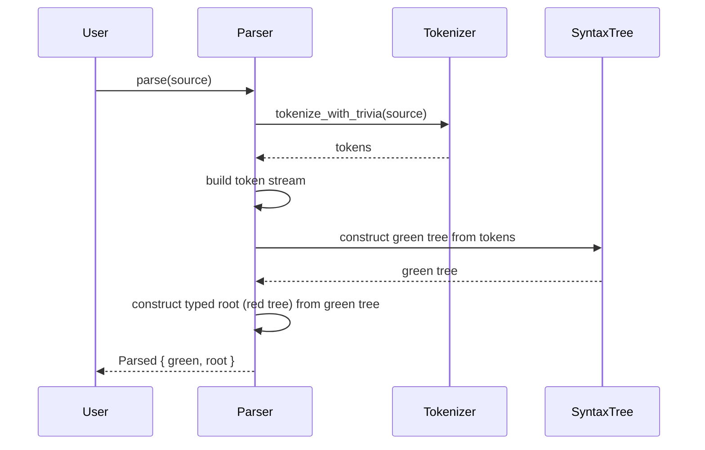

# A design document and implementation roadmap for the Differential Datalog linter

## Introduction

This document presents the comprehensive architectural design and
implementation roadmap for a new static analysis tool for the Differential
Datalog (DDlog) language, hereafter referred to as `ddlint`. The primary
mission of this project is to enhance developer productivity and code quality
within the DDlog ecosystem by providing a performant, configurable, and
user-friendly linter.

Developer Experience (DX) sits at the core of the design philosophy. The linter
must satisfy the end-users who will consume the diagnostics, and it must
empower the engineers who contribute to its development. This is achieved
through a carefully selected, modern technology stack, coupled with an
architecture that prioritizes clarity, modularity, and extensibility. Every
design choice, from the foundational data structures to the user-facing output,
is made with the goal of creating a tool that is both powerful in its analysis
and intuitive in its use. This document serves as the definitive technical
blueprint for the implementation team.

For clarity, this roadmap uses the following terminology consistently. A
*concrete syntax tree (CST)* represents the full source text, including
whitespace and comments, while an *abstract syntax tree (AST)* captures only
the semantic structure that downstream analyses consume. Together with a focus
on Developer Experience, these abstractions underpin every architectural
decision outlined below.

## 1. Architectural blueprint: a concrete syntax tree (CST)-first linter engine

The foundation of any modern static analysis tool is its internal
representation of source code. The choice of this representation dictates the
scope of possible features, influences performance, and defines the developer
experience for those building rules. For `ddlint`, the architecture will be
built upon a Concrete Syntax Tree (CST), a decision that enables a new class of
powerful, user-centric features.

### 1.1. The rationale for a concrete syntax tree (CST) architecture

The core of the linter will be a lossless Concrete Syntax Tree. Unlike a
traditional Abstract Syntax Tree (AST), which represents the semantic structure
of the code but discards non-semantic information, a CST is a perfect,
one-to-one representation of the source text. It retains every character,
including whitespace, comments, and even extraneous parentheses. This fidelity
is not a minor detail; it is the fundamental prerequisite for the advanced
features expected of a modern linter.

The primary benefits of this CST-first approach are twofold. First, it enables
highly accurate, context-rich diagnostics. When an issue is detected, the
linter has access to the exact byte offsets of the problematic code within the
original source file. This allows for precise highlighting, annotations, and
the rendering of source snippets that are faithful to what the user wrote.
Second, and critically, a CST is essential for reliable automated code fixing
(`autofix`). To rewrite a piece of code—for example, to correct a casing style,
or to remove a redundant clause—the tool must understand the source text
completely, including the whitespace, comments, and delimiters surrounding the
code to be changed, to avoid corrupting the file's formatting or structure.

To implement this CST, the project will utilize the `rowan` library.[^1]

`rowan` is a mature, generic, and battle-tested library for building lossless
syntax trees, and its adoption by major projects like `rust-analyzer` validates
its robustness and performance for production systems.[^1] The core innovation
of

`rowan` is its "Red/Green Tree" design.[^2] The "Green Tree" is the immutable,
untyped core data structure that stores the tree's topology efficiently. It is
composed of `GreenNode`s and `GreenToken`s and is cheap to clone and share
across threads. Layered on top of this is the "Red Tree," a typed, parent-aware
API that provides ergonomic, safe access to the syntax tree for analysis.[^2]
This separation provides the best of both worlds: the performance and memory
efficiency of a compact, immutable data structure and the safety and
convenience of a strongly typed API.

### 1.2. The linter core: adapting the `rslint_core` model

Rather than designing a linter engine from first principles, this project will
adapt the mature and performant model pioneered by `rslint_core`.[^3] The

`rslint` project demonstrates a highly effective architecture for a CST-based
linter, featuring parallelized rule execution, a clean separation of concerns,
and deliberate maintainability safeguards.[^4] Adopting this model allows the
team to leverage proven patterns and focus on implementing DDlog-specific logic.

The heart of this adapted engine will be a set of core traits that define the
structure and behaviour of every lint rule:

- `trait Rule`: This will be the base trait for all rules, containing shared
  metadata. It will expose methods such as `name()`, which returns a unique,
  kebab-case identifier (e.g., "unused-relation"); `group()`, which categorizes
  the rule (e.g., "correctness", "style"); and `docs()`, which provides
  detailed documentation for the rule.[^5] This metadata is not merely
  informational; it is functional, used by the CLI to generate help messages,
  by configuration systems to validate rule names, and by documentation
  generators.

- `trait CstRule`: This is the primary trait for the linter's logic. It is
  designed to operate directly on the `rowan` CST. It will define methods that
  the linter's runner can invoke for specific types of `SyntaxNode`s or
  `SyntaxToken`s. A crucial constraint is that all types implementing `CstRule`
  must be `Send + Sync`. This is because the runner will execute rules on
  different parts of the CST in parallel, and this constraint ensures thread
  safety.[^3]

- `struct RuleCtx`: To avoid global state and provide rules with the information
  they need, a `RuleCtx` (Rule Context) object will be passed to every rule
  invocation. This struct will act as a transient container for data relevant
  to the current linting operation, including a reference to the root of the
  CST, the full source text of the file, a unique identifier for the file being
  processed, and the user-provided configuration for the specific rule being
  executed.

The linter's engine, or **Rule Runner**, will be a visitor-based traversal
engine responsible for orchestrating the entire analysis. Its process will be
as follows:

1. Upon receiving a `rowan` CST for a file, the runner begins a traversal of the
   tree, visiting every node and token.

2. For each element, it queries a `CstRuleStore`—a central registry of all
   enabled lint rules—to identify which rules have registered an interest in
   the current element's `SyntaxKind`.

3. For each matching rule, the runner invokes the appropriate method (e.g.,
   `check_node`), passing it the node itself and the `RuleCtx`.

4. To maximize performance, these invocations will be dispatched to a thread
  pool (such as one managed by the `rayon` crate[^6]), allowing multiple rules
  to be checked against multiple nodes concurrently, a pattern proven effective
  by `rslint`.[^4]

### 1.3. The CST-centric toolchain

The selection of `rowan` and a CST-based architecture is not an isolated
decision but the cornerstone of a cohesive and deeply interconnected
development toolchain. This single choice creates a cascade of dependencies and
opportunities, shaping the selection of nearly every other major component in
the system.

The chain of architectural consequences begins with the project's highest-level
goals: to provide developers with rich, actionable diagnostics, and powerful,
automated fixing capabilities. This immediately makes a lossless representation
of the source code a non-negotiable requirement. A traditional abstract syntax
tree, by its nature, discards the very information (comments, whitespace, exact
formatting) needed for these features, rendering it insufficient. This leads
directly to the necessity of a CST. Within the Rust ecosystem, `rowan` is the
industry-standard, production-grade solution for this problem.[^1]

Once `rowan` is chosen, the next logical step is to select a linter engine
model that is designed to work with it. The `rslint_core` architecture, which
is explicitly built to run rules over a CST, becomes the ideal candidate,
providing a proven template for a performant, parallelized engine.[^3]

The choice of a CST has further downstream effects, particularly on
diagnostics, testing, and tooling. To display the kind of rich, annotated error
messages seen in modern compilers, the reporting library needs precise source
location information. The `rowan` CST, by preserving all byte offsets from the
original file, can provide the exact `SourceSpan` data required to render
`miette`'s beautiful, user-friendly error reports.[^7] This creates a powerful
synergy:

`rowan` provides the data, and `miette` provides the presentation.

Finally, this chain extends to the testing strategy. How can one reliably test
the complex, multi-line, formatting-rich textual output generated by `miette`?
Simple string comparisons with `assert_eq!` are brittle and difficult to
maintain. The solution is snapshot testing, and the `insta` crate is the
premier tool for this in Rust.[^8]

`insta` allows the test suite to capture the exact textual output of a
diagnostic and save it as a "snapshot." On subsequent test runs, any change to
this output, however minor, will cause the test to fail, immediately flagging a
regression. This allows developers to review and approve changes to diagnostic
output with confidence using the `cargo insta review` tool.[^8]

This creates a virtuous cycle: the need for advanced features mandates a CST
(`rowan`), which enables a specific engine design (`rslint_core`-style) and
rich diagnostics (`miette`), which in turn requires a specific testing
methodology (`insta`). This transforms the component list from a simple
"shopping list" of libraries into a coherent, interdependent architectural
strategy where each part reinforces the others.

## 2. The parsing pipeline: from source text to syntax tree

The first, and most critical, step in the linting process is the transformation
of raw DDlog source text into the structured `rowan` CST that the rest of the
system consumes. The quality and resilience of this parsing stage directly
determine the linter's ability to provide value, especially when evaluating
real‑world code that is often in a syntactically incomplete or incorrect state.

Short description: the following sequence diagram outlines the parsing pipeline
from source to syntax tree.



After tokenization the parser wraps the vector of tokens in a lightweight
`TokenStream`. This structure manages the current cursor and exposes helper
methods such as `line_end` or `skip_ws_inline`. Navigating tokens through this
abstraction avoids manual index arithmetic and reduces boundary errors.

### 2.1. Defining the DDlog `SyntaxKind`

Following the established `rowan` pattern, the grammar of the DDlog language
must be encoded into a `SyntaxKind` enum.[^2] This enum serves as the set of
type tags for every possible element in the syntax tree. It will include
variants for all terminals (tokens like identifiers, keywords, and
punctuation), along with non-terminals (nodes representing language constructs
like relations, rules, and expressions).

A crucial aspect of this enum is its machine representation. It must be defined
with `#[repr(u16)]` and derive the `FromPrimitive` and `ToPrimitive` traits
from the `num-derive` crate.[^9] This is because `rowan`'s internal
`GreenNode`s are untyped and use a `rowan::SyntaxKind`, which is a newtype
wrapper around a `u16`, for their type tags. These derivations provide a safe
and efficient mechanism to convert between the strongly typed `SyntaxKind` enum
and `rowan`'s generic `u16` representation.[^2] A special

`N_ERROR` variant will also be included to represent locations in the tree
where the parser encountered a syntax error but was able to recover.

An example of this enum's definition would be:

```rust,no_run
use num_derive::{FromPrimitive, ToPrimitive};

#
#[repr(u16)]
enum SyntaxKind {
    // Tokens (terminals)
    T_COMMENT,          // A line or block comment
    T_WHITESPACE,       // One or more whitespace characters
    T_IDENT,            // An identifier, like a relation or variable name
    T_STRING_LIT,       // A string literal
    T_NUMBER,           // A numeric literal
                        // decimal, floating-point, hex, binary, or octal
    T_LPAREN,           // '('
    T_RPAREN,           // ')'
    T_LBRACE,           // '{'
    T_RBRACE,           // '}'
    T_COLON,            // ':'
    T_COMMA,            // ','
    T_DOT,              // '.'
    T_IMPLIES,          // ':-'
    K_INPUT,            // 'input' keyword
    K_OUTPUT,           // 'output' keyword
    K_RELATION,         // 'relation' keyword
    K_IMPORT,           // 'import' keyword

    // Nodes (non-terminals)
    N_ROOT,             // The root of the file
    N_IMPORT_STMT,      // An import statement
    N_TYPED_IDENT,      // An identifier with a type, e.g., `x: u32`
    N_RELATION_DECL,    // A full relation declaration
    N_ATOM,             // An atom, e.g., `MyRel(x, "foo")`
    N_RULE,             // A full rule, with a head and body
    N_RULE_BODY,        // The list of literals after ':-'

    // Special
    N_ERROR,            // A node representing a parsing error
}
```

To complete the integration with `rowan`, the `rowan::Language` trait must be
implemented for a newtype that wraps the project’s `SyntaxKind`. This trait
acts as the bridge, with its `kind_from_raw` and `kind_to_raw` methods using
the `FromPrimitive` and `ToPrimitive` implementations to connect the specific
DDlog grammar to the generic `rowan` machinery.[^2]

### 2.2. Parser implementation strategy: leveraging `chumsky`

Assuming a pre-existing, lossless, error-recovering DDlog parser is not readily
available, one will be implemented using the `chumsky` parser-combinator
library.[^10]

`chumsky` is an ideal choice for building a linter's parser for several
compelling reasons.

First, its use of expressive combinators allows for the definition of a grammar
in a declarative, readable, and highly maintainable way. Complex parsers are
built by composing smaller, simpler, and reusable parsers, a methodology
analogous to using Rust's `Iterator` trait to build complex data processing
pipelines.[^10] This makes the parser easier to reason about, debug, and evolve
as the DDlog language itself changes.

Second, and most importantly for a linter, `chumsky` provides first-class,
flexible error recovery strategies out of the box.[^11] A linter is most
valuable when providing feedback on code as it is being written, which means
the code is frequently in a syntactically invalid state. A traditional parser
would fail at the first error, rendering the linter useless.

`chumsky`'s recovery strategies, however, allow the parser to recognize an
error, encapsulate the invalid tokens into a special error node, and then
resynchronize its state by looking ahead for a known-good token (like a
semicolon, a closing brace, or the start of the next keyword). It can then
continue parsing the rest of the file. This resilience is `chumsky`'s most
critical feature for this project.

Finally, `chumsky` is designed for high performance. It includes an internal
optimizer that leverages Generic Associated Types (GATs) to fuse and optimize
the parser's structure, and it supports zero-copy parsing to minimize
allocations.[^10]

The output of the `chumsky`-based parser will not be a conventional abstract
syntax tree. Instead, it will be designed to directly construct a
`rowan::GreenNode`, which is the precise input required by the linter's core
engine. This direct-to-CST parsing avoids an intermediate allocation and
translation step, further improving performance.

### 2.3. The symbiotic relationship between parser and linter

The utility of a linter is directly proportional to the quality of its parser's
error recovery. This creates a powerful, symbiotic relationship between the
parsing pipeline and the end-user's experience. A parser that halts on the
first syntax error relegates the linter to a batch-mode tool, useful only on
complete, correct programs. In contrast, a parser with robust error recovery
transforms the linter into an interactive assistant, providing continuous value
in the most common use case: reviewing code as a developer is actively writing
it.

Consider the typical workflow of a developer using an IDE with an integrated
linter. The code is in a constant state of flux and is syntactically invalid
more often than not. If the developer introduces a typo in one rule, a
traditional, non-recovering parser would stop, report a single "syntax error"
message, and provide no further information. The linter would receive no syntax
tree to evaluate and would be silent about potential issues in other, perfectly
valid rules within the same file.

A parser built with `chumsky`'s recovery strategies fundamentally changes this
dynamic.[^11] When it encounters the same typo, it does not halt. Instead, it
performs a series of actions:

1. It recognizes that the current token stream does not match any valid grammar
   production.

2. It emits an `N_ERROR` node into the CST, wrapping the invalid tokens to
   signify that this part of the tree is broken.

3. It invokes a recovery strategy, such as skipping tokens until it finds the
   beginning of the next `relation` or `import` keyword.

4. Once resynchronized, it resumes parsing as normal.

The result is that the linter's engine receives a *complete* CST for the entire
file. This tree contains valid subtrees for all the correctly written code,
interspersed with `N_ERROR` nodes that mark the locations of syntax errors. The
linter's rule runner can then traverse this tree, examining all the valid nodes
and simply skipping over the `N_ERROR` nodes.

This elevates the user experience from frustrating to empowering. The developer
receives immediate feedback not only on the syntax error they just introduced
but also on all the correct code in the rest of the file. A typo in one rule no
longer blinds the linter to a logical error in another. This makes the choice
of `chumsky` not merely an implementation detail of the parser, but a strategic
investment in the core usability and value proposition of the entire linting
tool. It enables the linter to function as a helpful "co-pilot" during
development, rather than a rigid "gatekeeper" that only runs after the fact.

## 3. The rule ecosystem: definition, configuration, and management

The true power, and the resulting utility, of a linter are derived from its set
of rules. A well-designed rule ecosystem is one that is easy for contributors
to extend, simple for users to configure, and logically organized. This section
details the anatomy of a lint rule, the tools for its creation, and the initial
catalog of rules to be implemented.

### 3.1. Anatomy of a lint rule

Each lint rule in `ddlint` will be a self-contained unit, implemented as a Rust
`struct`. This `struct` will be responsible for its own logic and metadata by
implementing the two core rule traits.

The `Rule` trait serves as the metadata provider. Every rule must implement it
to provide essential, self-describing information that the linter engine uses
for organization, configuration, and documentation. The required methods are
`name()`, `group()`, and `docs()`. [^5] This ensures that every rule is
programmatically identifiable, and its purpose is discoverable without needing
to read its source code.

The `CstRule` trait contains the analytical logic. Its methods, such as
`check_node(&self, node: &SyntaxNode, ctx: &RuleCtx)`, will be called by the
runner during the CST traversal. Inside these methods, the rule will inspect
the provided `SyntaxNode`, use the `RuleCtx` to access file-level information
or configuration, and report any discovered issues by creating and returning
`Diagnostic` objects. This design keeps the logic for each rule encapsulated
and testable in isolation.

### 3.2. A declarative macro for rule creation (`declare_lint!`)

To streamline the development of new rules, reduce boilerplate, and improve the
overall developer experience for linter contributors, the project will
implement a declarative macro named `declare_lint!`. This approach is heavily
inspired by the successful use of a similar macro in `rslint_core`.[^4]

The `declare_lint!` macro will abstract away the repetitive parts of rule
definition. A developer will provide the core information: the rule's
documentation (written as standard Rust doc comments), a `PascalCase` name for
the rule's `struct`, the group it belongs to, and its default severity level.
The macro will then expand this concise definition into the full `struct`
definition and the complete `impl Rule` block. It will parse the doc comments
and automatically populate the `docs()` method, ensuring that the documentation
lives right next to the code it describes and is never out of sync.

An example of how a developer would define a new rule using this macro is as
follows:

```rust,no_run
declare_lint! {
    /// ## What it does
    /// Checks for relations that are declared but are never used as input to another rule.
    ///
    /// ## Why is this bad?
    /// An unused relation can indicate dead code that should be removed, or it may
    /// point to a typo in a rule that was intended to consume this relation.
    /// Removing it can reduce the complexity of the program.
    ///
    /// ## Example
    ///
    /// ```ddlog
    /// // Bad
    /// input relation Unused(x: u32)
    /// relation Used(x: u32)
    /// output relation Result(x: u32)
    ///
    /// Result(x) :- Used(x). // `Unused` is never read from
    ///
    /// // Good
    /// input relation Used(x: u32)
    /// output relation Result(x: u32)
    ///
    /// Result(x) :- Used(x).
    /// ```
    pub UnusedRelation,
    group: "correctness",
    // The default severity will also be specified here, e.g., level: "warn"
}
```

This macro dramatically lowers the barrier to entry for contributing new rules.
It allows developers to focus on the interesting part—the analysis logic—rather
than the ceremony of trait implementations. This encourages community
involvement and accelerates the growth of the linter's rule set.

### 3.3. Initial lint rule catalog

To provide clear scope for the initial implementation phases and to deliver
immediate value to users, the following catalog of rules is proposed. This list
prioritizes correctness checks, followed by performance hints, and stylistic
suggestions, establishing a solid foundation of essential lints.

| Rule Name              | Group       | Default Level | Autofixable | Description                                                                                                                        |
| ---------------------- | ----------- | ------------- | ----------- | ---------------------------------------------------------------------------------------------------------------------------------- |
| unused-relation        | correctness | warn          | No          | Detects relations that are defined but never read from.                                                                            |
| unused-variable        | correctness | warn          | No          | Detects variables bound in a rule head that are not used in the body.                                                              |
| shadowed-variable      | correctness | warn          | No          | Detects when a variable binding in a literal shadows one from a preceding literal in the same rule body.                           |
| recursive-negation     | correctness | error         | No          | Detects rules with recursion through negation, which leads to unsafe, non-monotonic programs.                                      |
| inefficient-join-order | performance | hint          | No          | Evaluates rule bodies and suggests reordering atoms for a more efficient join plan, e.g., placing more restrictive literals first. |
| superfluous-group-by   | performance | warn          | Yes         | Detects group_by clauses where the aggregation is trivial (e.g., grouping by all variables) and can be removed.                    |
| consistent-casing      | style       | allow         | Yes         | Enforces a consistent casing style for relation and type identifiers (e.g., PascalCase) and variables (e.g., snake_case).          |
| no-magic-numbers       | style       | allow         | No          | Flags the use of unnamed numeric literals in rule bodies where a named constant might be clearer.                                  |

This table serves as a concrete work breakdown for the engineering team and
clearly communicates the linter's initial capabilities and priorities to early
adopters.

## 4. User interface and configuration layer

The success of a developer tool depends heavily on its user interface. A
powerful analysis engine is of little use if it is difficult to configure, or
if its output is hard to understand. This section defines the command-line
interface (CLI) and configuration system for `ddlint`, designed to be intuitive
for new users while remaining powerful for advanced use cases.

### 4.1. CLI design

The primary user interaction with the linter will be through its command-line
binary, `ddlint`. The CLI will be built using the `clap` crate,[^12] the
standard for robust argument parsing in the Rust ecosystem.

The core commands will be:

- `ddlint <FILES…>`: This is the default invocation. It will lint a list of
  specified files or directories, recursively searching for `.dl` files. It
  will respect ignore patterns and output diagnostics to standard error.

- `ddlint --fix <FILES…>`: This command performs the same linting process but
  will also apply any safe, automatic fixes suggested by the rules.

- `ddlint rules`: This utility command will list all available lint rules,
  printing their kebab-case name, the group they belong to, and their default
  severity level. This makes the linter's capabilities discoverable.

- `ddlint explain <RULE_NAME>`: This provides an integrated documentation
  system. It will print the detailed documentation for a specific rule, sourced
  directly from the doc comments in the `declare_lint!` macro.[^4] This allows
  users to understand a warning without leaving their terminal.

Key command-line arguments, and their flags, will include:

- `--format <compact|json|rich>`: Controls the output format. The `rich` format
  (default) will use `miette` for beautiful, annotated output. `json` will
  provide machine-readable output for integration with other tools, and
  `compact` will be a simpler, single-line format.

- `--config <PATH>`: Allows the user to specify an explicit path to a
  configuration file, overriding the default discovery mechanism.

- `--no-ignore`: Disables the default ignore patterns (e.g., for `.git` or
  `target` directories), allowing all files to be processed.

The behaviour of this CLI—including its arguments, exit codes, `stdout`, and
`stderr`—will be subject to rigorous integration testing. The `assert_cmd`
crate is purpose-built for this task, providing a fluent API to run the
compiled binary as a child process and assert on its results.[^13] Tests will
cover successful runs, failure on

`error`-level diagnostics, and the exact content of the output for various
scenarios.[^13]

### 4.2. The configuration file (`ddlint.toml`)

To provide persistent and project-specific configuration, `ddlint` will support
a configuration file named `ddlint.toml`. The `config-rs` crate will be used to
manage all aspects of configuration.[^14] This library is an excellent choice
due to its powerful layered configuration system. It can merge settings from
multiple sources with a defined precedence: built-in defaults, values from a
configuration file, and overrides from environment variables. This provides
users with maximum flexibility. While

`config-rs` supports Tom's Obvious, Minimal Language (TOML), YAML, and JSON out
of the box, and TOML will be the documented standard due to its prevalence and
readability in the Rust ecosystem.[^14]

The linter will automatically search for a `ddlint.toml` file in the current
working directory and then traverse up through parent directories, allowing for
a single configuration file at the root of a project to apply to all its
subdirectories.

### 4.3. Configuration file schema (`ddlint.toml`)

A clearly defined schema is essential for user documentation and for enabling
features like IDE autocompletion. The `ddlint.toml` file will be structured to
be simple and extensible. The following table specifies the initial schema.

| Key                       | Type             | Default                                            | Description                                                                                                                                                         |
| ------------------------- | ---------------- | -------------------------------------------------- | ------------------------------------------------------------------------------------------------------------------------------------------------------------------- |
| extends                   | String           | (none)                                             | A path to a base configuration file. Settings from the current file will override settings from the extended file.                                                  |
| ignore_patterns           | Array of Strings | [".git/", "build/", "target/"]                     | A list of glob patterns that exclude specific files and directories from linting.                                                                                   |
| [rules]                   | Table            | (empty)                                            | This section is the primary location for configuring individual rule severities and options.                                                                        |
| [rules].`<rule-name>`     | String           | (rule default)                                     | Sets the severity for a rule. Valid values are "allow" (disables the rule), "warn", or "error". An error will cause the linter to exit with a non-zero status code. |
| [rules.consistent-casing] | Table            | { level = "allow", relation_style = "PascalCase" } | An example of a rule with options. The level is set alongside rule-specific configuration keys.                                                                     |

This schema provides a clear and powerful way for teams to tailor the linter's
behaviour to project-specific needs, from disabling entire classes of rules to
fine-tuning the parameters of stylistic checks.

### 4.4. Logging

The parser emits warnings using the [`log`](https://docs.rs/log/) crate. No
logger is initialized by default. A consuming binary should call a logger setup
routine early in `main` to surface these messages. One convenient option is
[`env_logger`](https://docs.rs/env_logger/):

```rust,no_run
fn main() {
    // Cargo.toml: env_logger = "0.11"
    env_logger::init();
    // run ddlint or the application logic
}
```

Set the `RUST_LOG` environment variable to control verbosity. For example,
`RUST_LOG=warn` displays warnings while suppressing debug output.

## 5. Advanced features: diagnostics and automated fixes

The core value of a linter is delivered through its diagnostics and its ability
to help the user fix the identified problems. This section details the
implementation of a state-of-the-art diagnostic system and a safe, reliable
autofixing mechanism, which together form the linter's primary user-facing
features.

### 5.1. Implementing rich diagnostics with `miette`

All user-facing diagnostic output will be generated using the `miette`
library.[^7]

`miette` enables the transition from simple, single-line error messages to a
rich, contextual, and highly readable diagnostic experience, similar to that of
the Rust compiler itself.[^15]

The implementation will leverage several key `miette` features:

- **Annotated Snippets**: The most powerful feature of `miette` is its ability
  to display snippets of the user's source code with annotations. Using the
  `SourceSpan` and `SourceCode` types, the linter will pinpoint the exact
  location of an issue, highlighting the relevant code with contrastive
  underlines and labels.[^7] This is made possible by the

  `rowan` CST, which preserves the necessary byte-offset information.

- **Labels and Hints**: A single diagnostic can have multiple labels. This will
  be used to provide richer context. For example, a `shadowed-variable` warning
  can have one label on the new, shadowing variable and a second "note" label
  on the original variable's definition, showing the user exactly what is being
  shadowed and where it came from.

- **Error Codes and URLs**: Every rule will have a unique code (e.g.,
  `correctness::unused-relation`). This code will be included in the diagnostic
  output. Furthermore, `miette` supports embedding URLs in diagnostics, which
  become clickable links in modern terminals.[^7] This feature will be used to
  link each diagnostic directly to the rule's online documentation page,
  allowing a user to go from a warning in their terminal to a detailed
  explanation with a single click.

- **Custom Theming**: `miette`'s appearance is customizable via themes.[^7] This
  allows the linter's output to be styled with a distinctive theme palette,
  potentially matching the branding of DDlog or allowing users to select themes
  for accessibility.

To integrate this, the linter's internal `Diagnostic` struct will be designed
to be easily and losslessly convertible into a `miette::Diagnostic`. The
`RuleCtx` will provide the rule logic with all the necessary components: the
`SourceCode` (the full text of the file) and the `SourceSpan` for any node or
token in the CST.

### 5.2. The autofixing mechanism

For rules that are marked as `Autofixable` in the rule catalog, the linter will
be able to not only report the problem but also apply a suggested fix
automatically when run with the `--fix` flag.

The implementation of this feature must be carefully designed to work with the
immutable `rowan` tree and the parallelized rule runner. The core data
structure for a fix, called a "suggestion," consists of a `TextRange` (the
slice of the original source text to be replaced) and a `String` (the new text
to insert).

The autofixing workflow will proceed as follows:

1. During the parallel linting phase, rules that can be autofixed will, in
   addition to generating a diagnostic, also generate an associated fix
   suggestion. These suggestions are collected by the runner alongside the
   diagnostics.

2. The runner does not modify the code during this phase. This is critical
   because applying a fix in-place would invalidate the text ranges for all
   other nodes, making parallel execution impossible.

3. After the parallel run is complete, and after all suggestions have been
   collected, the runner checks if the `--fix` flag was provided.

4. If it was, the runner first filters the suggestions to ensure there are no
   overlapping fixes, as applying two fixes to the same piece of code is
   ambiguous and unsafe. In case of conflicts, no fixes are applied for the
   conflicting range.

5. The runner then applies the safe, non-overlapping suggestions to the source
   text buffer. To ensure that applying one fix does not invalidate the
   position of the next, the fixes are applied in reverse order, from the end
   of the file to the beginning.

6. Finally, the modified text buffer is written back to the original file on
   disk.

### 5.3. The "trust but verify" principle of autofixing

Autofixing is an immensely powerful feature, but it is also inherently
dangerous. A bug in the fixing logic can silently corrupt a user's source code,
leading to a catastrophic loss of trust in the tool. Therefore, testing
autofixable rules demands an exceptionally rigorous strategy, one that goes
beyond simply testing the diagnostic output. It must validate the correctness
of the code transformation itself.

This leads to a "dual snapshot" testing approach. For any autofixable rule, two
distinct types of tests are required. The first is the standard diagnostic
test: run the linter on a piece of incorrect code and use `insta` to create a
snapshot of the `miette` diagnostic message that is produced. This verifies
that the problem is reported correctly.

The second, more critical test verifies the fix itself. This test will be
structured as follows:

1. A test function defines an input DDlog program as a string.

2. It programmatically invokes the linter's core logic with the `--fix` flag
   enabled on this input string.

3. It captures the *modified* source code string that results from the
   autofixing process.

4. It uses `insta::assert_snapshot!` to assert this modified string against a
   stored snapshot.

Developers implementing a new fix follow an intentionally seamless workflow.
The first time they run this new test, it will fail because no snapshot exists.
`insta` will save the transformed code into a `.snap.new` file.[^8] The
developer then uses

`cargo insta review` to examine the proposed change. If the code transformation
is correct, they accept it, and it becomes the new, approved snapshot. From
that point forward, any future refactoring of the autofix logic that
accidentally changes the output of the transformation will cause the snapshot
test to fail, immediately catching the regression.

This dual-snapshot strategy—one for the diagnostic message and one for the
resulting code—creates a robust safety net. It allows developers to implement
and refactor complex code transformations with a high degree of confidence,
knowing that any deviation from the verified, correct output will be caught
automatically by the Continuous Integration (CI) system.

## 6. A comprehensive testing and validation strategy

A linter is a compiler-like tool, and its correctness, reliability, and
performance are paramount. A bug in a linter can lead to incorrect warnings,
missed errors, or, in the worst case, corruption of user code via faulty
autofixes. To ensure the highest level of quality, a multi-layered testing
strategy will be employed, covering every component of the system from
individual rule logic to the final command-line binary.

### 6.1. Unit testing individual rules

The foundation of the testing pyramid is the unit test. Each lint rule's logic
will be tested in isolation to verify its correctness. A testing harness will
be developed to facilitate this. This harness will consist of a helper function
that takes a string of DDlog code and the specific rule to be tested as input.
It will then execute the full parsing and linting pipeline but *only* for that
single rule, returning the list of diagnostics it produced.

Each rule will have test cases covering both positive and negative scenarios.
For example, for the `unused-relation` rule, there would be a
`test_unused_relation_positive` case with an unused relation that asserts a
diagnostic is produced, and a `test_unused_relation_negative` case where all
relations are used, which asserts that no diagnostics are produced. This
granular level of testing ensures that the core logic of each rule is sound
before it is integrated into the larger system.

### 6.2. Snapshot testing diagnostic output with `insta`

To ensure that the user-facing output of the linter is correct, consistent, and
does not degrade over time, snapshot testing will be used extensively. This is
particularly critical for validating the rich, multi-line output with `miette`
emphasis styling, as this output is difficult to test with traditional string
assertions.

The `insta` crate is the de-facto standard for snapshot testing in the Rust
ecosystem and will be the primary tool for this purpose.[^8] The testing
workflow will involve creating a suite of small DDlog code snippets. Each
snippet is designed to trigger one or more specific diagnostics. A test
function will run the linter on a snippet and capture the resulting diagnostic
string. This string is then asserted against a stored reference value (the
"snapshot") using a macro like

`insta::assert_snapshot!` or `insta::assert_debug_snapshot!`.[^8]

When a diagnostic's output is changed (for instance, to improve its wording),
the corresponding snapshot test will fail. The developer can then use the
`cargo insta review` command-line tool to interactively inspect the difference
between the old and new output. If the change is intentional and correct, they
can approve it with a single keystroke, updating the snapshot file for future
test runs.[^8] This workflow makes maintaining a large suite of complex
diagnostic tests manageable and robust.

### 6.3. Integration testing the CLI with `assert_cmd`

The final layer of testing involves treating the compiled `ddlint` binary as a
black box and testing its end-to-end behaviour from the command line. This
ensures that all components—argument parsing, configuration file loading, file
discovery, linting, and output formatting—work together correctly.

The `assert_cmd` crate is the ideal tool for this, providing a fluent and
expressive API for orchestrating and asserting on command-line processes.[^13]
Integration tests will be written in the

`/tests` directory of the crate, which is standard practice for testing a
binary's public interface.[^16]

These integration tests will cover a wide range of scenarios:

- Verifying that the linter exits with a success code when run on valid files or
  files with only `warn`-level issues (`.assert().success()`).

- Verifying that the linter exits with a failure code when it encounters an
  `error`-level diagnostic (`.assert().failure().code(1)`).[^13]

- Asserting on the exact content of `stdout` and `stderr` to ensure the correct
  diagnostics are printed in the correct format.

- Testing the full matrix of CLI arguments, such as `--format=json` or
  `--no-ignore`.

- Verifying that configuration files (`ddlint.toml`) are correctly located and
  that their settings properly override the defaults.

- Testing file system interactions, such as the behaviour of the `--fix` flag,
  likely in combination with a crate like `assert_fs` for creating temporary
  file fixtures.[^17]

This comprehensive, three-tiered testing strategy ensures that every aspect of
the linter is validated, from the micro-level logic of a single rule to the
macro-level behaviour of the final executable.

## 7. Phased implementation roadmap and future work

This design is translated into an actionable, multiphase project plan. Each
phase is designed to deliver concrete, demonstrable value, and build upon the
foundations laid by the previous one. This iterative approach mitigates risk
and allows for feedback to be incorporated throughout the development cycle.

### Phase 1: The foundation (target: 1–2 sprints)

The goal of this initial phase is to establish the core project structure and
validate the fundamental architectural choices. It is a proof-of-concept phase
focused on getting a minimal end-to-end pipeline working.

- **Tasks:**

  1. Initialize the Rust project workspace using `cargo`.

  2. Define the initial `SyntaxKind` enum for a minimal but non-trivial subset
     of the DDlog grammar (e.g., relation declarations and simple rules).

  3. Implement a basic parser for this subset using `chumsky`.[^10] The parser's
     output must be a valid

     `rowan` CST.[^1]

  4. Implement a single, simple rule (e.g., a rule that flags numeric literals,
     `no-magic-numbers`) to demonstrate the ability to traverse the CST and
     identify nodes of interest.

  5. Emit diagnostics to the console using basic `println!` calls. No rich
     formatting is required at this stage.

- **Deliverable:** A command-line binary that can successfully parse a simple
  DDlog file and print a basic warning message to the console. This deliverable
  validates the `chumsky`-to-`rowan` pipeline.

### Phase 2: The engine (target: 3–4 sprints)

With the foundation in place, this phase focuses on building out the robust,
scalable linter engine, the rule management system, and the user-facing CLI.

- **Tasks:**

  1. Implement the full linter engine inspired by `rslint_core`, including the
     `Rule` and `CstRule` traits, the `RuleCtx` struct, the `CstRuleStore`, and
     the parallelized rule runner.[^3]

  2. Implement the `declare_lint!` macro to streamline rule creation.[^4]

  3. Integrate the `config-rs` crate to load and parse `ddlint.toml`
     configuration files, respecting the defined schema.[^14]

  4. Build the full CLI using `clap`, implementing the `explain` and `rules`
     subcommands and all specified flags.

  5. Implement the initial set of "correctness" rules from the catalog, such as
     `unused-relation` and `recursive-negation`.

  6. Establish the full testing infrastructure, writing snapshot tests with
     `insta`[^8] and CLI integration tests with `assert_cmd`.[^13]

- **Deliverable:** A functional, configurable CLI linter. It can be installed
  and run on real DDlog projects, it respects configuration from a
  `ddlint.toml` file, and it reports a useful set of correctness-related
  diagnostics.

### Phase 3: Polish and expansion (target: 3–4 sprints)

This phase is dedicated to enhancing the user experience and expanding the
linter's analytical capabilities to cover the full language and a wider range
of issues.

- **Tasks:**

  1. Replace all diagnostic `println!` calls with rich, beautifully formatted
    output generated by the `miette` library.[^7]

  2. Implement the autofixing infrastructure as described in the design. Add
     automatic fixes for all rules marked as `Autofixable` in the catalog, with
     corresponding "dual snapshot" tests.

  3. Expand the `chumsky` parser to cover the complete DDlog language
     specification, ensuring it has robust error recovery strategies for all
     major syntactic constructs.

  4. Implement the remaining "performance" and "style" rule sets from the
     catalog.

  5. Write comprehensive user documentation covering installation,
     configuration, all CLI commands, and details for every implemented rule.

- **Deliverable:** A feature-complete, polished, and well-documented linter
  ready for a stable 1.0 release.

### Phase 4 (future): IDE integration via the language server protocol (LSP)

The architecture designed in the preceding phases explicitly paves the way for
future extension into an IDE language server. The decoupling of the core
linting logic into a reusable library is the key enabler for this.

- **High-Level Plan:**

  1. A new binary crate will be created within the workspace to house the
     language server. This server will depend on the core `ddlint` crate as a
     library.

  2. A dedicated LSP framework library, such as `tower-lsp`, will be used to
     handle the boilerplate of the Language Server Protocol (LSP) communication
     (JavaScript Object Notation (JSON) Remote Procedure Call (RPC), message
     handling, etc.).

  3. The `lsp-types` crate will be used for all LSP-defined data
     structures.[^18]
    This ensures protocol compliance and provides strongly typed Rust
    representations for messages like

     `PublishDiagnosticsParams` and `Diagnostic`.[^19]

  4. The core work will be to implement the LSP notification handlers, such as
     textDocument/didOpen and textDocument/didChange. When the server receives
     a notification that a document has changed, it will:

     a. Retrieve the updated document text.

     b. Invoke the ddlint core library to run the linter on this text.

     c. Receive a list of internal Diagnostic objects from the linter.

     d. Translate these objects into the lsp_types::Diagnostic format.

     e. Send the translated diagnostics back to the IDE client via a
     textDocument/publishDiagnostics notification.

- **Deliverable:** A DDlog language server that provides real-time, on-the-fly
diagnostics directly within supported editors like Visual Studio Code,
completing the vision of a truly interactive developer assistant.

[^1]: `rowan` crate documentation. <https://docs.rs/rowan/latest/rowan/>

[^2]: Rust Analyzer manual, "Syntax Trees". Explains the red/green architecture
      and `SyntaxKind`.
      <https://rust-analyzer.github.io/manual.html#syntax-trees>

[^3]: RSLint project repository and architecture overview.
      <https://github.com/rslint/rslint>

[^4]: RSLint developer guide on rule execution and the `declare_lint!` macro.
      <https://rslint.org/dev-guide/writing-rules.html>

[^5]: `rslint_core::rule::Rule` trait documentation.
      <https://docs.rs/rslint_core/latest/rslint_core/rule/trait.Rule.html>

[^6]: `rayon` crate documentation covering parallel iterators.
      <https://docs.rs/rayon/latest/rayon/>

[^7]: `miette` crate documentation on annotated snippets and theming.
      <https://docs.rs/miette/latest/miette/>

[^8]: `insta` snapshot testing documentation, including the `cargo insta review`
      workflow. <https://insta.rs/docs/>

[^9]: `num-derive` crate documentation for `FromPrimitive`/`ToPrimitive`.
      <https://docs.rs/num-derive/latest/num_derive/>

[^10]: `chumsky` crate documentation for parser combinators.
       <https://docs.rs/chumsky/latest/chumsky/>

[^11]: `chumsky` README section on error recovery strategies.
       <https://github.com/zesterer/chumsky#recovering-from-errors>

[^12]: `clap` crate documentation for CLI argument parsing.
       <https://docs.rs/clap/latest/clap/>

[^13]: `assert_cmd` crate documentation for CLI testing.
       <https://docs.rs/assert_cmd/latest/assert_cmd/>

[^14]: `config` crate documentation for layered configuration.
       <https://docs.rs/config/latest/config/>

[^15]: Rust compiler error code reference documenting diagnostic style.
       <https://doc.rust-lang.org/rustc/error_codes.html>

[^16]: *The Rust Programming Language*, chapter 11.3 on test organization and
       integration tests.
       <https://doc.rust-lang.org/book/ch11-03-test-organization.html>

[^17]: `assert_fs` crate documentation for temporary file fixtures.
       <https://docs.rs/assert_fs/latest/assert_fs/>

[^18]: `lsp-types` crate documentation for strongly typed LSP messages.
       <https://docs.rs/lsp-types/latest/lsp_types/>

[^19]: Language Server Protocol specification section on
       `textDocument/publishDiagnostics`.
       <https://microsoft.github.io/language-server-protocol/specifications/specification-current/#publishDiagnostics>
