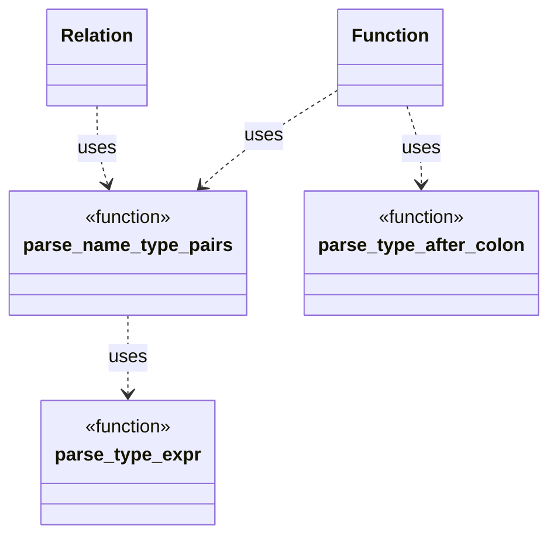

# Function Parsing Design

This document outlines the strategy for parsing `function` definitions and
declarations within `ddlint`. The parser relies on small helpers to interpret
parameter lists and optional return types. These helpers now live in the
`parser::ast::parse_utils` module so that both `Function` and `Relation` AST
nodes can reuse them.

## Parameter list parsing

`parse_name_type_pairs` walks the token stream produced for the parameter list.
Whenever it encounters a colon, it delegates to `parse_type_expr`.  
That helper is now fully recursive: on seeing `(`, `[`, `{` or `<`, it calls  
itself to read the matching closing delimiter. This means nested types such as  
`Vec<Map<string, Vec<u8>>>` are parsed without any external delimiter stack.  
Parameters end when a comma or the closing `)` of the list is reached.

Missing colons between a parameter name and type trigger
`ParseError::MissingColon`. The span of the terminating comma or parenthesis is  
attached, so diagnostics point at the error. Helper functions  
`collect_parameter_name` and `finalise_parameter` keep the main loop small.

Empty names and types are reported with `ParseError::MissingName` and
`ParseError::MissingType`. `parse_type_expr` skips whitespace and comment nodes
and reports mismatched delimiters with a `ParseError::Delimiter` that records
the expected and actual tokens. Unclosed delimiters produce
`ParseError::UnclosedDelimiter` once parsing stops.
