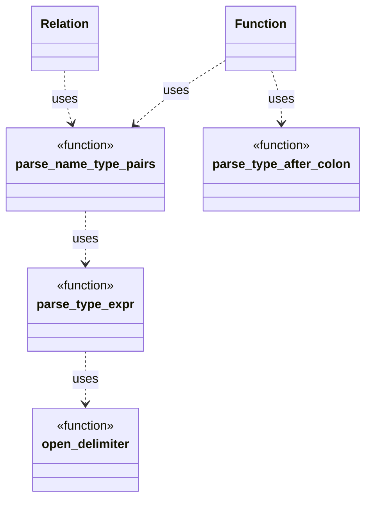

# Function parsing design

This document outlines the strategy for parsing `function` definitions and
declarations within `ddlint`. The parser relies on small helpers to interpret
parameter lists and optional return types. These helpers now live in the
`parser::ast::parse_utils` module so that both `Function` and `Relation` AST
nodes can reuse them. A span-aware helper, `open_delimiter`, pushes the
delimiter kind and token span onto `DelimStack`. The following diagram shows
how helper functions compose during parsing.



## Parameter list parsing

`parse_name_type_pairs` walks the token stream produced for the parameter list.
Whenever it encounters a colon, it delegates to `parse_type_expr`.\
That helper is now fully recursive: on seeing `(`, `[`, `{`, or `<`, it calls\
itself to read the matching closing delimiter. This means nested types such as\
`Vec<Map<string, Vec<u8>>>` are parsed without any external delimiter stack.\
Parameters end when a comma or the closing `)` of the list is reached.

Missing colons between a parameter name and type trigger
`ParseError::MissingColon`. The span of the terminating comma or parenthesis is
attached, so diagnostics point at the error. Helper functions
`collect_parameter_name` and `finalise_parameter` keep the main loop small.

Empty names and types are reported with `ParseError::MissingName` and
`ParseError::MissingType`. `parse_type_expr` skips whitespace and comment nodes
and reports mismatched delimiters with a `ParseError::Delimiter` that records
the expected and actual tokens. Unclosed delimiters produce
`ParseError::UnclosedDelimiter` once parsing stops, highlighting the position
of the opening delimiter.

A hierarchy of error types supports rich diagnostics when delimiters do not
match or names and types are missing. The following diagram shows delimiter
tracking and error types during parsing.

```mermaid
classDiagram
    class Delim {
        <<enum>>
        Paren
        Angle
        Bracket
        Brace
    }
    class OpenDelimiter {
        kind: Delim
        span: TextRange
    }
    class DelimStack {
        +open(delim: Delim, span: TextRange, count: usize)
        +close(delim: Delim, count: usize)
        +is_empty(): bool
        -Vec<OpenDelimiter>
    }
    class DelimiterError {
        +expected: Delim
        +found: SyntaxKind
        +span: TextRange
    }
    class ParseError {
        <<enum>>
        Delimiter(DelimiterError)
        UnclosedDelimiter { delimiter: char, span: TextRange }
        MissingColon
        MissingName
        MissingType
    }

    DelimStack *-- OpenDelimiter
    OpenDelimiter *-- Delim
    DelimiterError *-- Delim
    ParseError *-- DelimiterError
```

The `count` argument on `open` and `close` represents how many delimiter units
are encoded in a single token. When the lexer emits combined delimiters such as
`<<`, it calls `open` with `count` set to two so nesting remains accurate.
