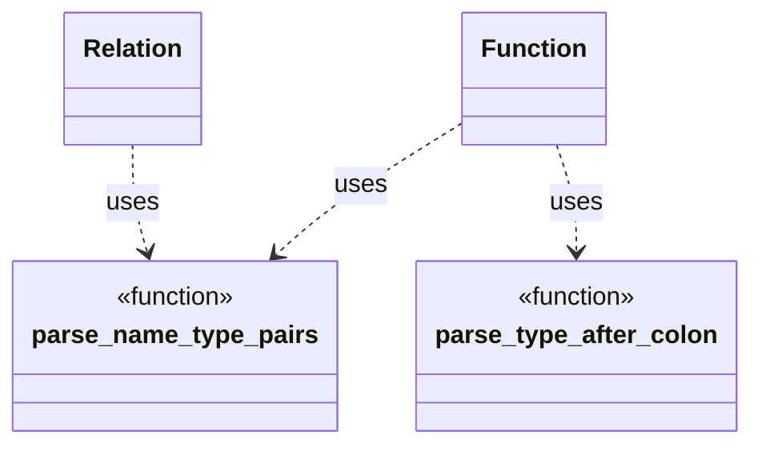

# Function Parsing Design

This document outlines the strategy for parsing `function` definitions and
declarations within `ddlint`. The parser relies on small helpers to interpret
parameter lists and optional return types. These helpers are shared with
relation parsing to avoid duplication.

