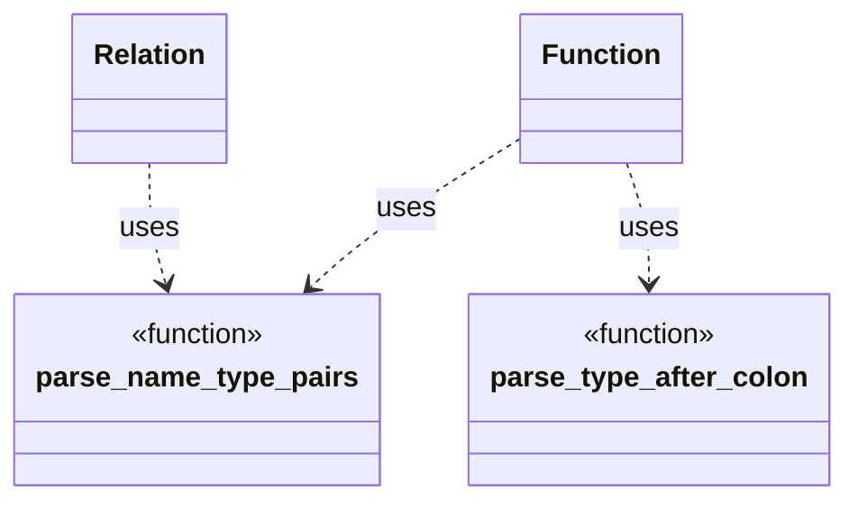

# Function Parsing Design

This document outlines the strategy for parsing `function` definitions and
declarations within `ddlint`. The parser relies on small helpers to interpret
parameter lists and optional return types. These helpers now live in the
`parser::ast::parse_utils` module so that both `Function` and `Relation` AST
nodes can reuse them.

## Parameter list parsing

`parse_name_type_pairs` walks the token stream produced for the parameter list.
Commas end a parameter only when the parser is not inside any nested delimiters.
A small stack tracks openings of `(`, `<`, `[` and `{`. Closing tokens remove
entries from the stack, ensuring that nested generics like
`Vec<Map<string, Vec<u8>>>` do not confuse the outer list terminator. The
opening `(` of the list is accounted for separately so that the closing `)` can
be recognised without scanning the stack.
