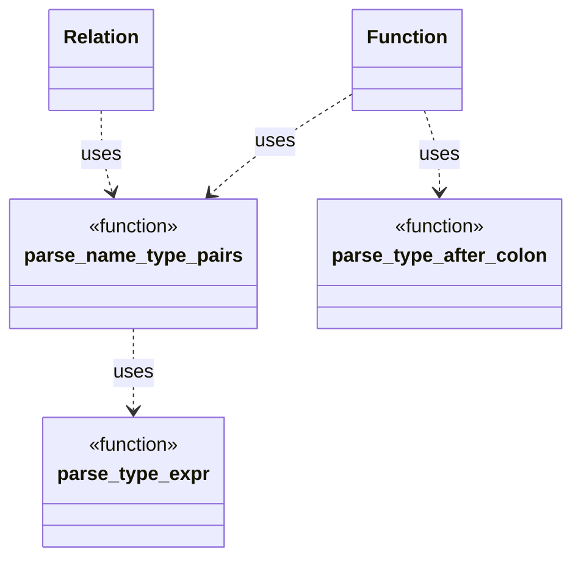

# Function Parsing Design

This document outlines the strategy for parsing `function` definitions and
declarations within `ddlint`. The parser relies on small helpers to interpret
parameter lists and optional return types. These helpers now live in the
`parser::ast::parse_utils` module so that both `Function` and `Relation` AST
nodes can reuse them.

## Parameter list parsing

`parse_name_type_pairs` walks the token stream produced for the parameter list.
Each time a colon is encountered the function delegates to `parse_type_expr` to
capture the following type expression. That helper recursively parses nested
delimiters so constructs like `Vec<Map<string, Vec<u8>>>` are handled without
maintaining a delimiter stack in `parse_name_type_pairs` itself. Parameters end
when a comma or the closing `)` of the list is reached.
