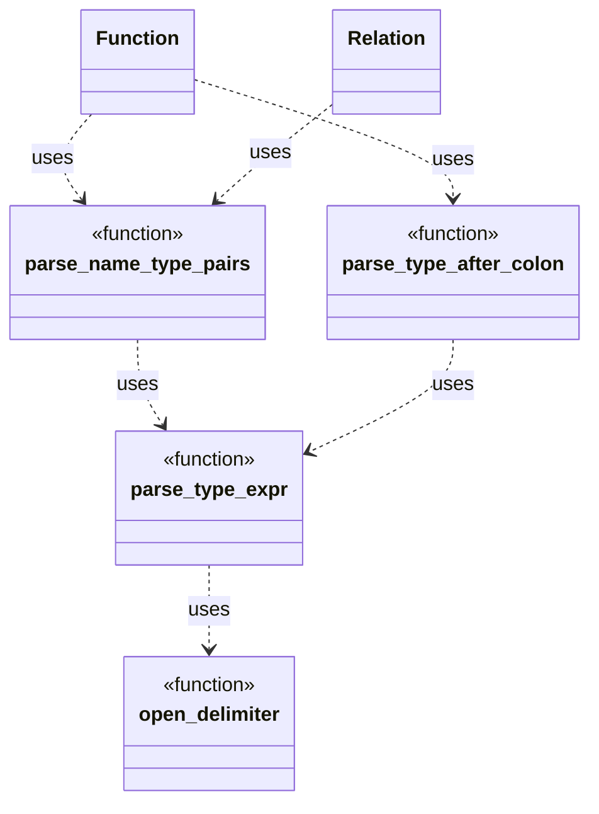
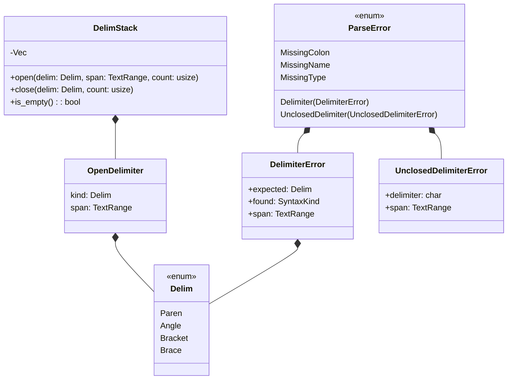

# Function parsing design

This document outlines the strategy for parsing `function` definitions and
declarations within `ddlint`. The parser relies on small helpers to interpret
parameter lists and optional return types. These helpers now live in the
`parser::ast::parse_utils` module so that both `Function` and `Relation`
Abstract Syntax Tree (AST) nodes can reuse them. A span-aware helper,
`open_delimiter`, pushes the delimiter kind and token span onto `DelimStack`.

Short description: the following diagram shows how helper functions compose
during parsing.

`parse_type_after_colon` handles optional return types. It skips trivia,
verifies the presence of a colon and then delegates to `parse_type_expr` so
return types benefit from the same delimiter tracking and trivia skipping.

## Parameter list parsing

`parse_name_type_pairs` walks the token stream produced for the parameter list.
Whenever it encounters a colon, it delegates to `parse_type_expr`. That helper
is now fully recursive: on seeing `(`, `[`, `{`, or `<`, it pushes the opening
delimiter (with span) onto `DelimStack`, recurses to parse the inner
expression, and then expects the matching closer. Nested types such as
`Vec<Map<string, Vec<u8>>>` are handled by this recursion in tandem with the
delimiter stack. Parameters end when a comma or the closing `)` of the list is
reached.

Missing colons between a parameter name and type trigger
`ParseError::MissingColon`. The span of the terminating comma or parenthesis is
attached, so diagnostics point at the error. Helper functions
`collect_parameter_name` and `ParameterBuilder` keep the main loop small.

Empty names and types are reported with `ParseError::MissingName` and
`ParseError::MissingType`. Both `collect_parameter_name` and `parse_type_expr`
skip whitespace and comment tokens, so no trivia appears in the extracted text.
`parse_type_expr` reports mismatched delimiters with a `ParseError::Delimiter`
that records the expected and actual tokens. Unclosed delimiters produce
`ParseError::UnclosedDelimiter` once parsing stops, highlighting the position
of the opening delimiter. In addition to the stack-driven path, utilities that
balance delimiters (e.g., `extract_delimited` in `parse_utils/delimiter.rs`,
also available under the transitional alias `extract_parenthesized`) can also
surface unclosed-delimiter errors, which likewise report the opening token’s
span.

A hierarchy of error types supports rich diagnostics when delimiters do not
match or names and types are missing. Short description: the following diagram
shows delimiter tracking and related error types.

The `count` argument on `open` and `close` represents how many delimiter units
are encoded in a single token. When the lexer emits combined delimiters such as
`<<`, it calls `open` with `count` set to two so nesting remains accurate.
