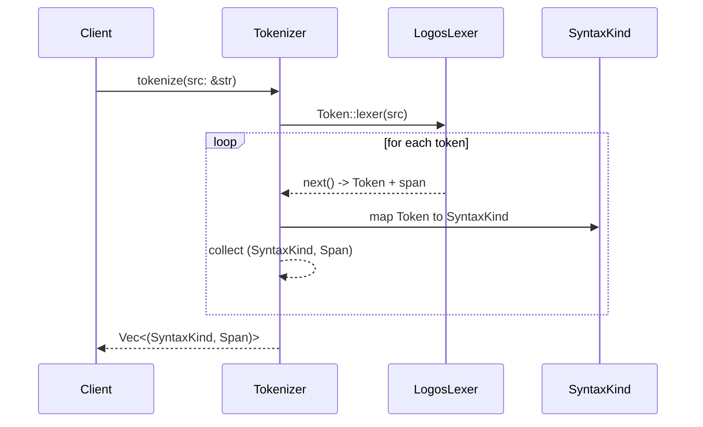

# Parser Porting Plan

This document outlines how to port the Haskell parser found in
`differential-datalog-1.2.3/src/Language/DifferentialDatalog/Parse.hs` to a Rust
implementation that leverages the `chumsky` parser combinator library and builds
a `rowan`-based Concrete Syntax Tree (CST) alongside the Abstract Syntax Tree
(AST).

## 1. Review the Existing Haskell Parser

1. Study the token definitions and parser entry points in the Haskell source.
2. Identify each grammar production and note its corresponding structure in the
   AST.
3. Enumerate lexical elements, including keywords, operators, and punctuation.
   These will become tokens.

## 2. Define `SyntaxKind`

Follow the guidance in the design document:

- Create a `SyntaxKind` enum covering every token and node in the grammar.
- Derive `FromPrimitive` and `ToPrimitive` and use `#[repr(u16)]` so that each
  kind can map to `rowan::SyntaxKind`. The design notes this pattern explicitly
  ([design document](docs/ddlint-design-and-road-map.md#L71-L122)).
- Include an `N_ERROR` variant for error recovery.

Implement `rowan::Language` for a `DdlogLanguage` newtype, using the conversions
provided by `num-derive`. This allows `rowan` to store `SyntaxKind` tags
transparently.

## 3. Build a Tokenizer

Use `chumsky`'s text utilities (or integrate a `logos` lexer if preferred) to
convert the source text into a stream of `(SyntaxKind, Span)` pairs. Each span
records byte offsets so that the resulting CST can precisely mirror the input.
Whitespace and comments should produce tokens so they can be preserved. The
current implementation opts for a small `logos` lexer because it keeps the token
definitions declarative while still interoperating smoothly with `chumsky`
parsers. Keyword lookups use a `phf::Map` for zero-cost perfect hashing.

## 4. Construct the Parser with `chumsky`

1. Express each grammar rule using `chumsky` combinators. The parser should
   return both an AST node and instructions for the CST builder.
2. Wrap every recognized token into its `SyntaxKind` and push it into a
   `GreenNodeBuilder` from `rowan`.
3. For syntactic errors, emit an `N_ERROR` node and recover by skipping to a
   known synchronisation point, as recommended by the design document
   ([design document](docs/ddlint-design-and-road-map.md#L124-L139)).

The parser's final output is the AST root together with a `GreenNode` that
contains the full CST.

## 5. Map CST Nodes to AST Structures

Implement lightweight AST types that reference the CST. Each AST node should
store a `SyntaxNode` from `rowan`, allowing rules to navigate the tree while
still providing ergonomic typed access for semantic processing.

## 6. Testing Strategy

1. Reuse examples from the Haskell project as fixtures. Ensure the new parser
   produces equivalent AST structures and that the CST round-trips to the source
   text.
2. Write unit tests for individual grammar constructs and integration tests for
   whole files.

## 7. Integration Steps

1. Add the new parser module under `src/parser` and expose a `parse` function
   returning `(GreenNode, AstRoot)`.
2. Update the build system to depend on `chumsky` and `rowan`.
3. Replace any existing placeholders with the new parser in the linter pipeline.

This plan bridges the mature Haskell implementation with the CST-first approach
outlined in the design document, ensuring that parsing, error recovery, and CST
construction happen in one efficient pass.

## 8. Handling Left-Recursive Grammar

Chumsky does not support left recursion directly. Any left-recursive productions
from the Haskell parser must be refactored into right-recursive or iterative
forms before translation. For example, left-associative expression chains can be
parsed using `foldl`-style helpers that combine a list of operands and operators
after parsing. This avoids infinite recursion while preserving associativity.

## 9. Performance Benchmarks

To catch regressions, add micro-benchmarks that parse representative DDlog files
and measure throughput and memory allocations. Compare these results with the
existing Haskell parser using similar inputs. Benchmarks should run in CI so
performance changes are visible in pull requests.

## 10. Modelling Trivia Tokens

Whitespace and comments are tokenised as `T_WHITESPACE` and `T_COMMENT` variants
so the CST preserves them. AST wrappers skip over these trivia nodes, ensuring
that semantic analyses operate on significant tokens only.
