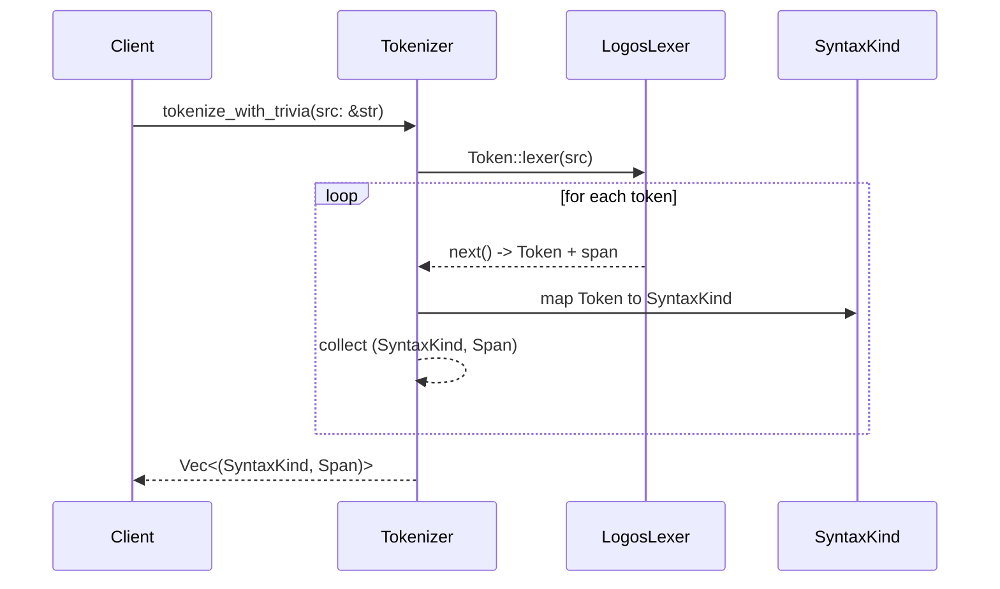
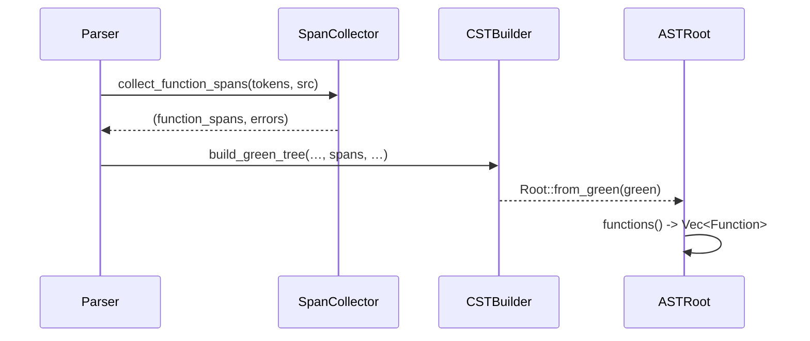

# Parser porting plan

This document outlines how to port the Haskell parser found in
`differential-datalog-1.2.3/src/Language/DifferentialDatalog/Parse.hs` to a
Rust implementation that leverages the `chumsky` parser combinator library and
builds a `rowan`-based Concrete Syntax Tree (CST) alongside the Abstract Syntax
Tree (AST).

## 1. Review the existing Haskell parser

1. Study the token definitions and parser entry points in the Haskell source.
2. Identify each grammar production and note its corresponding structure in the
   AST.
3. Enumerate lexical elements, including keywords, operators, and punctuation.
   These will become tokens.

## 2. Define `SyntaxKind`

Follow the guidance in the design document:

- Create a `SyntaxKind` enum covering every token and node in the grammar.
- Derive `FromPrimitive` and `ToPrimitive` and use `#[repr(u16)]` so that each
  kind can map to `rowan::SyntaxKind`. The design notes this pattern explicitly
  in Section 1.2 of the
  [design document](docs/ddlint-design-and-road-map.md#12-the-linter-core-adapting-the-rslint_core-model).
- Include an `N_ERROR` variant for error recovery.

Implement `rowan::Language` for a `DdlogLanguage` newtype, using the
conversions provided by `num-derive`. This allows `rowan` to store `SyntaxKind`
tags transparently.

## 3. Build a tokenizer

Use `chumsky`'s text utilities (or integrate a `logos` lexer if preferred) to
convert the source text into a stream of `(SyntaxKind, Span)` pairs. Each span
records byte offsets so that the resulting CST can precisely mirror the input.
Whitespace together with comments should produce tokens, so they can be
preserved. The current implementation opts for a small `logos` lexer because it
keeps the token definitions declarative while still interoperating smoothly
with `chumsky` parsers. Keyword lookups use a `phf::Map` for zero-cost perfect
hashing.

## 4. Construct the parser with `chumsky`

1. Express each grammar rule using `chumsky` combinators. The parser should
   return both an AST node and instructions for the CST builder.
2. Wrap every recognized token into its `SyntaxKind` and push it into a
   `GreenNodeBuilder` from `rowan`.
3. For syntactic errors, emit an `N_ERROR` node and recover by skipping to a
   known synchronisation point, as recommended by the design document ([design
   document](docs/ddlint-design-and-road-map.md#L124-L139)).

The parser's final output is the AST root together with a `GreenNode` that
contains the full CST.

`build_green_tree` expects every list of statement spans to be sorted by start
offset and free from overlaps. The function checks all span lists and returns a
single aggregated error describing any misordered or overlapping spans,
preventing mismatched nodes in the resulting CST.

Token spans are validated before the CST builder advances span cursors. In
debug builds, an out-of-bounds token span triggers a panic so lexer bugs are
caught early. In release builds, the builder logs a warning and skips the
token, keeping error recovery predictable while avoiding panics for user inputs.

## 5. Map CST nodes to AST structures

Implement lightweight AST types that reference the CST. Each AST node should
store a `SyntaxNode` from `rowan`, allowing rules to navigate the tree while
still providing ergonomic typed access for semantic processing.

### Rule body term extraction

The `Rule` wrapper exposes a `body_terms()` helper that classifies each rule
literal into one of three variants:

- `Expression` – atoms, conditions, and control-flow statements parsed via the
  Pratt expression parser.
- `Assignment` – pattern binds such as `var ip = FlatMap(extract_ips(ips))`.
  The left-hand side is parsed into a dedicated `Pattern` AST node so later
  passes can inspect binding structure without re-parsing text. The same
  pattern parser is reused for `match` arms and `for` bindings.
- `Aggregation` – canonical `group_by(project, key)` calls and legacy
  `Aggregate((key), accumulator)` invocations. Legacy calls flip their
  arguments during classification, so downstream code always receives a
  `(project, key)` pair regardless of the surface syntax.

This keeps AST consumers from re-implementing literal splitting logic or
grappling with `FlatMap`/`Aggregate` being tokenized as keywords.

## 6. Testing strategy

1. Reuse examples from the Haskell project as fixtures. Ensure the new parser
   produces equivalent AST structures and that the CST round-trips to the
   source text.
2. Write unit tests for individual grammar constructs and integration tests for
   whole files.

## 7. Integration steps

1. Add the new parser module under `src/parser` and expose a `parse` function
   returning `(GreenNode, AstRoot)`.
2. Update the build system to depend on `chumsky` and `rowan`.
3. Replace any existing placeholders with the new parser in the linter pipeline.

This plan bridges the mature Haskell implementation with the CST-first approach
outlined in the design document, ensuring that parsing, error recovery, and CST
construction happen in one efficient pass.

## 8. Handling left-recursive grammar

Chumsky does not support left recursion directly. Any left-recursive
productions from the Haskell parser must be refactored into right-recursive or
iterative forms before translation. For example, left-associative expression
chains can be parsed using `foldl`-style helpers that combine a list of
operands and operators after parsing. This avoids infinite recursion while
preserving associativity.

## 9. Performance benchmarks

To catch regressions, add micro-benchmarks that parse representative DDlog
files and measure throughput and memory allocations. Compare these results with
the existing Haskell parser using similar inputs. Benchmarks should run in
Continuous Integration (CI), so performance changes are visible in pull
requests.

## 10. Modelling trivia tokens

Whitespace tokens, together with comment tokens, are emitted as `T_WHITESPACE`
and `T_COMMENT` variants, so the CST preserves them. AST wrappers skip over
these trivia nodes, ensuring that semantic analyses operate on significant
tokens only.

## 11. Aggregation extraction and validation

The parser extracts `group_by` and legacy `Aggregate` constructs during rule
body analysis, normalizing them into a unified `RuleAggregation`
representation. This allows downstream analyses to work with a consistent model
regardless of the surface syntax.

### 11.1 Aggregation detection

When `Rule::body_terms()` encounters a top-level function call with the name
`group_by` or `Aggregate`, the call is classified as an aggregation rather than
a regular expression:

- **`group_by(project, key)`** – the canonical form; arguments are preserved
  in order.
- **`Aggregate((key), project)`** – the legacy form; arguments are swapped so
  the resulting `RuleAggregation` always has `(project, key)` ordering.

### 11.2 Arity validation

Both aggregation forms require exactly two arguments. Calls with fewer or more
arguments produce a diagnostic pointing to the literal span.

### 11.3 At-most-one validation

Per the DDlog specification (§6.1), at most one aggregation is permitted per
rule body. If `body_terms()` encounters a second aggregation, it reports an
error whose span points to the duplicate aggregation.

### 11.4 Design rationale

Performing aggregation extraction during AST construction (rather than a
separate pass) ensures:

1. Downstream code sees a consistent `RuleAggregation` structure without
   needing to detect and normalize aggregations itself.
2. Diagnostic spans point precisely at the offending literals, rather than
   referencing synthetic or rewritten nodes.
3. The validation mirrors the specification's requirement that aggregation
   misuse is a parse-time error.
